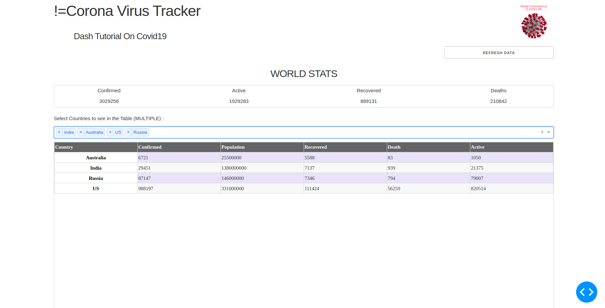

# Interactive-Covid19-Tracker-Visualisation-Tool-with-Dash-Python-Plotly

#### By - Om Prasad Nayak

### Installation
- Python version 3.7 or more
- Install all pip packages mentioned in the requirements.txt by ```pip install package_name```

### To Execute the application :-
- Open a terminal and run ```python app.py```





### Credits
- Adriano Yoshino(Basics of Dash) - https://www.youtube.com/channel/UCcAkFRh-n0sU8osHmpZ6b0Q
- Pomber(Covid19 data) - https://github.com/pomber/covid19
- Gapminder(Data for different factors) - https://www.gapminder.org/data/
- Kaggle(Lockdown date data) - https://www.kaggle.com/jcyzag/covid19-lockdown-dates-by-country/data#countryLockdowndatesJHUMatch.csv
- Plotly Docs - https://plotly.com/python/table/#changing-row-and-column-size
- Dash Docs - https://dash.plotly.com/dash-core-components